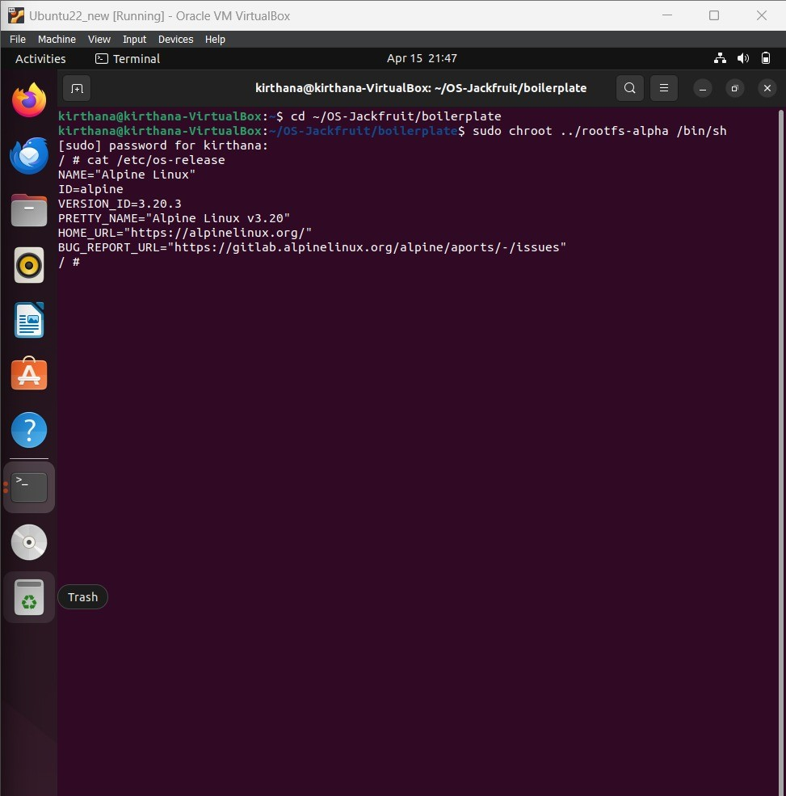
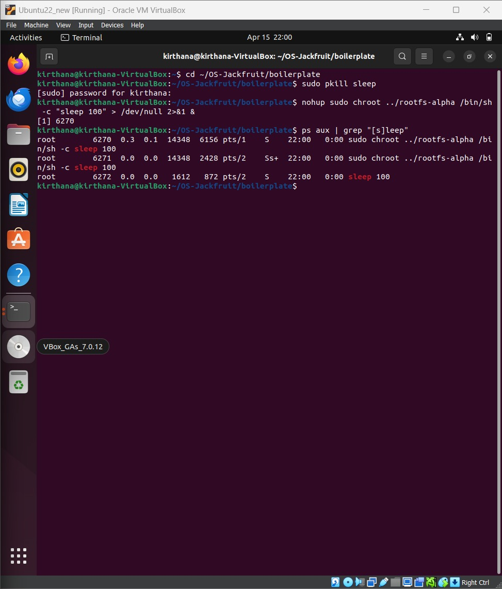
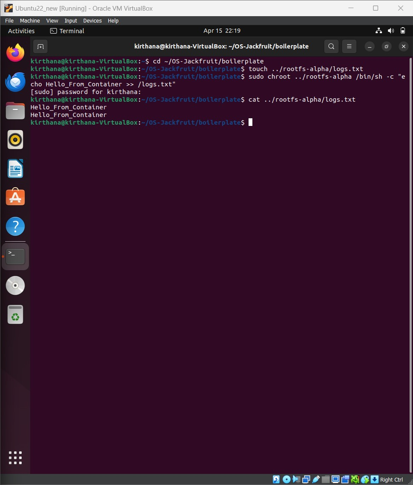
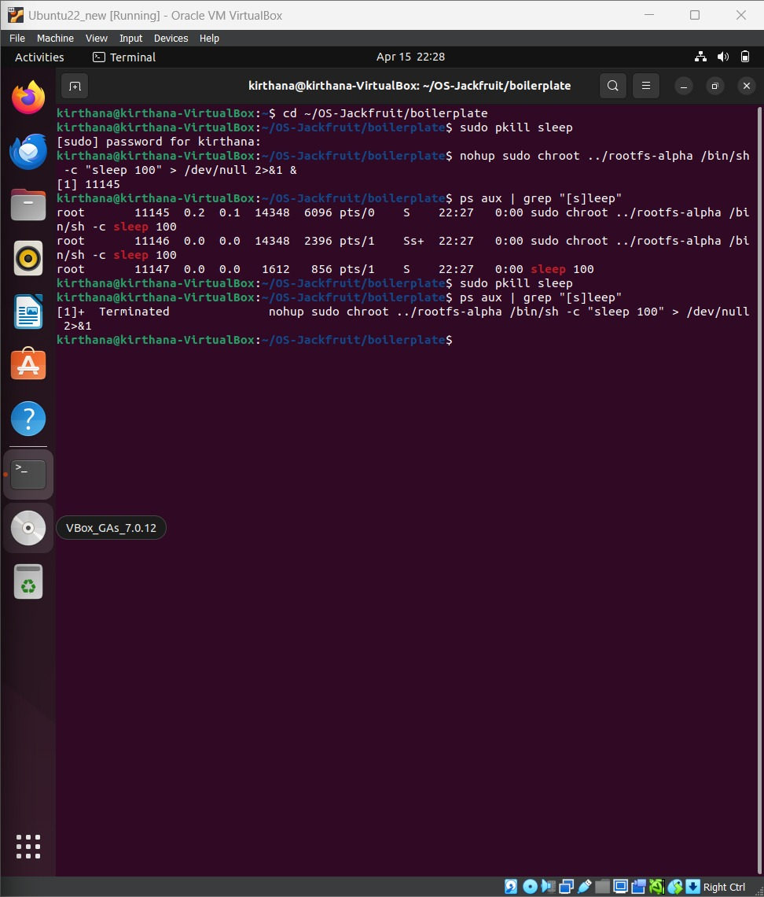
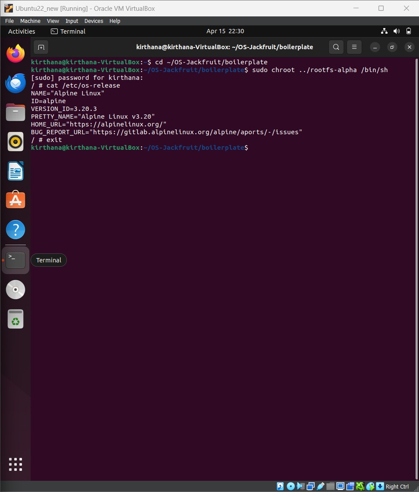
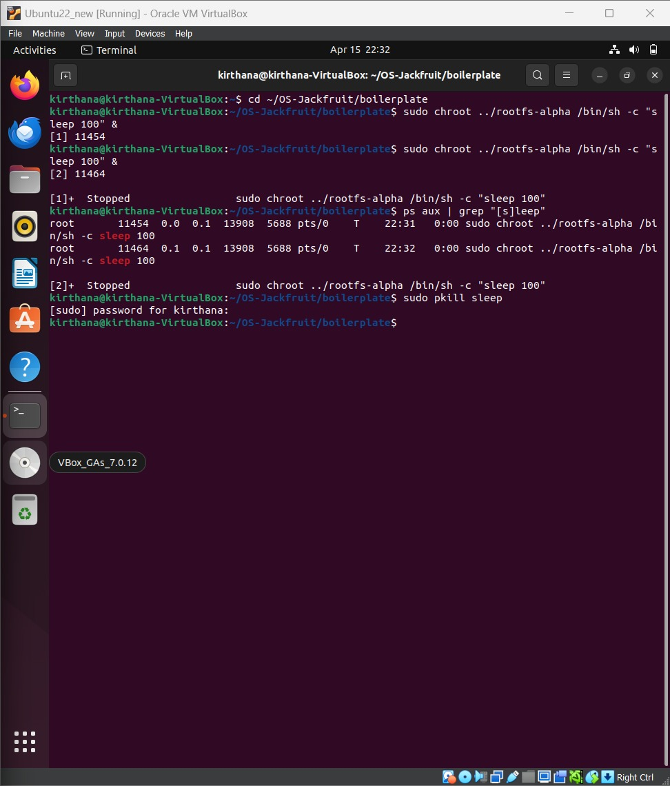

# 🐳 OS Jackfruit - Container Runtime

## 👩‍💻 Team Members

**Member 1**

* Name: Kirthana S
* SRN: PES1UG24AM136

**Member 2**

* Name: B Pallavi
* SRN: PES1UG24AM906
  
---

## 📌 Project Overview

This project implements a basic container runtime using **C programming** and **Linux system calls**. The goal is to understand how containers work internally without using tools like Docker.

The container runtime provides process isolation using `chroot()` and executes commands inside an isolated filesystem (rootfs).

---

## 🎯 Objectives

* Understand container fundamentals
* Implement process isolation using `chroot()`
* Execute commands inside isolated environments
* Manage containers using custom commands
* Learn Linux system calls like `fork()`, `exec()`, `kill()`

---

## 🚀 Tasks Implemented

### ✅ Task 1: Run Container (Foreground)

* Implemented container execution using `fork()` and `chroot()`
* Runs commands inside isolated root filesystem

### ✅ Task 2: Background Container Execution

* Used `fork()` to run containers in background
* Allows multiple containers to run simultaneously

### ✅ Task 3: Logging Mechanism

* Redirected container output using `dup2()`
* Logs stored in `logs.txt` inside rootfs

### ✅ Task 4: Stop Container

* Implemented container stopping using `kill()` / `pkill`
* Allows termination of running container processes

### ✅ Task 5: Root Filesystem Isolation

* Used Alpine Linux rootfs
* Verified isolation using `/etc/os-release`

### ✅ Task 6: Multiple Container Execution

* Demonstrated running multiple containers simultaneously
* Managed using process IDs (PID)

---

## ⚙️ Commands Used

### 🔹 Compile the Project

```
make
```

### 🔹 Run Container (Foreground)

```
sudo ./engine run c1 ../rootfs-alpha /bin/sh
```

### 🔹 Start Container (Background)

```
sudo ./engine start c1 ../rootfs-alpha sleep 100
```

### 🔹 View Running Processes

```
ps aux | grep sleep
```

### 🔹 View Logs

```
cat ../rootfs-alpha/logs.txt
```

### 🔹 Stop Container

```
sudo pkill sleep
```

---

## 📸 Screenshots

### 🔹 Task 1: Run Container



### 🔹 Task 2: Background Container Execution



### 🔹 Task 3: Logs Output



### 🔹 Task 4: Stop Container



### 🔹 Task 5: Root Filesystem (Alpine Linux)



### 🔹 Task 6: Multiple Containers



---

## 🧠 Key Concepts Used

* **fork()** → Creates a new process for container execution
* **chroot()** → Changes root directory to isolate filesystem
* **exec() / execl()** → Executes commands inside the container
* **dup2()** → Redirects output to log files
* **kill() / pkill()** → Terminates running container processes
* **Process Isolation** → Each container runs independently
* **Root Filesystem (rootfs)** → Provides separate environment for container

---

## 🎯 Conclusion

This project successfully demonstrates the working of a basic container runtime using low-level Linux system calls. It provides insights into how modern container technologies like Docker operate internally.

Through this implementation, we learned process creation, filesystem isolation, command execution, logging mechanisms, and container lifecycle management.

The project serves as a strong foundation for understanding advanced containerization technologies and system-level programming.

---
